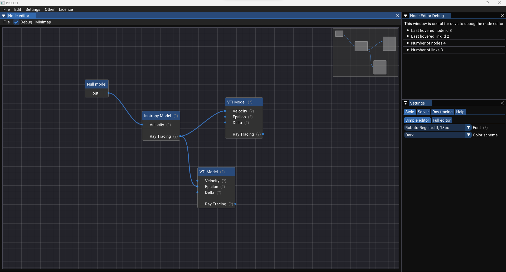

# Imgui - OpenGL - Linear algebra - CMake C++ template


A template project using [Imgui](external/imgui) as graphical user interface ([glfw](external/glfw), [glm](external/glm), [glew](external/glew) and [OpenGL](https://www.opengl.org/)), and [Eigen3](external/eigen) as linear algebra library.
For more details about the Apach 2.0 licence, visit [tldrlegal.com](https://tldrlegal.com/license/apache-license-2.0-(apache-2.0)).
For more details about the MIT licence, visit [tldrlegal.com](https://tldrlegal.com/license/mit-license)

Here is a screenshot of the application running a custom node editor based on [imnodes](https://github.com/Nelarius/imnodes/tree/d88f99125bb72cdb71b4c27ff6eb7f318d89a4c5):


## Dependencies

The code is build to run with the following libraries (included in the repository under [external](external/)):

- [OpenGL](https://www.opengl.org/) (specification)
- [GLEW](https://glew.sourceforge.net/)
- [GLFW](https://www.glfw.org/)
- [GLM](https://github.com/g-truc/glm)
- [Eigen](https://eigen.tuxfamily.org/index.php?title=Main_Page) 
- [ImGui](https://github.com/ocornut/imgui) 
- [Imnodes](https://github.com/Nelarius/imnodes/tree/d88f99125bb72cdb71b4c27ff6eb7f318d89a4c5) 
- [Implot](https://github.com/epezent/implot/tree/d87512353495e7760e7fda7566a05beef7627d8f)

## Structure

An organized structure has been chosen for this template.

- [assets](assets) contains the assets of the project such as fonts and pictures
- [cmake](cmake) contains a configure file to get the minor and major versions of the current project.
- [external](external) code goes into external folder at the root of the project.
- [include](include) gather every self written header file.
- [mains](mains) contains the main executable i.e. cpp file that drives all the project.
- [src](src) gather every self written cpp file of the project.
- [tests](tests) uses CTests to use a test driven approach during the development of the project.

## Cloning

This repository contains submodules meaning that a recursive cloning can be done.
To clone this repository, make sure you have git installed and clone the project into the chosen folder using

```bash
git clone --recursive https://github.com/Hardcode3/imgui_opengl_linear_algebra_cmake_starter
```

You can also clone the project using
```bash
git clone https://github.com/Hardcode3/imgui_opengl_linear_algebra_cmake_starter
```
In this case, dependencies will be cloned by cmake during the configuration stage.

## Configuring and generating

The build steps has been tested and runs fine on:

- Microsoft Windows 10, 11
- MacOSX
- Linux Ubuntu

### Configuration steps on Linux

Configuration on Linux requires additional libraries. Generaly, Linux tells you which library is lacking.
If required, run the following commands to install needed libraries (detailed in the cmake configuration and building process):

```bash
sudo apt-get update -y
```

Install OpenGL if needed:

```bash
sudo apt-get install libglu1-mesa-dev freeglut3-dev mesa-common-dev
```

```bash
sudo apt-get install -y libxrandr-dev
```

```bash
sudo apt-get install -y libxinerama-dev
```

```bash
sudo apt-get install -y libxcursor-dev
```

```bash
sudo apt-get install -y libxi-dev
```

### Configuration steps on macOS

There is no additional configuration step on macOS.

### Configuration steps on Windows

There is no additional configuration step on Windows.

### General configuration & build process

Make sure you have CMake installed and inside the clone repo, type:

```bash cmd terminal
mkdir build
cd build
cmake ..
cmake --build .
```

Or use CMakeGui for this.
For more details, check [cmake.org](https://cmake.org/)

Or launch one of the scripts in the [scritpts folder](scripts):

```bash
cd scripts
sh configure_n_build_debug.sh
```

## CTest integration
Generating the RUNTESTS target (CTests) should output something like this if everything is well configured:

```text
1>    Start 1: imgui_test
1>1/9 Test #1: imgui_test .......................   Passed    1.19 sec
1>    Start 2: eigen_test
1>2/9 Test #2: eigen_test .......................   Passed    0.01 sec
1>    Start 3: glew_glfw_test
1>3/9 Test #3: glew_glfw_test ...................   Passed    0.32 sec
1>    Start 4: glm_test
1>4/9 Test #4: glm_test .........................   Passed    0.01 sec
1>    Start 5: glfw_test
1>5/9 Test #5: glfw_test ........................   Passed    0.84 sec
1>    Start 6: timer_test
1>6/9 Test #6: timer_test .......................   Passed    0.16 sec
1>    Start 7: app_test
1>7/9 Test #7: app_test .........................   Passed    1.18 sec
1>    Start 8: csv_test
1>8/9 Test #8: csv_test .........................   Passed    0.01 sec
1>    Start 9: utils_str_test
1>9/9 Test #9: utils_str_test ...................   Passed    0.01 sec
1>
1>100% tests passed, 0 tests failed out of 9
1>
1>Total Test time (real) =   3.73 sec
```

This is a basis for further unit tests implementation. 
